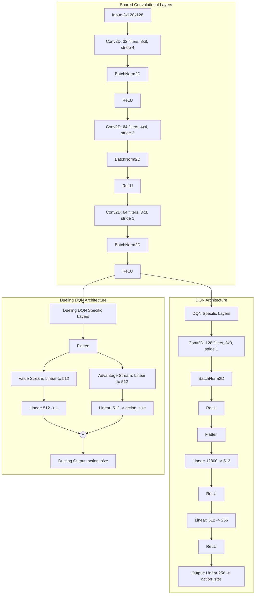
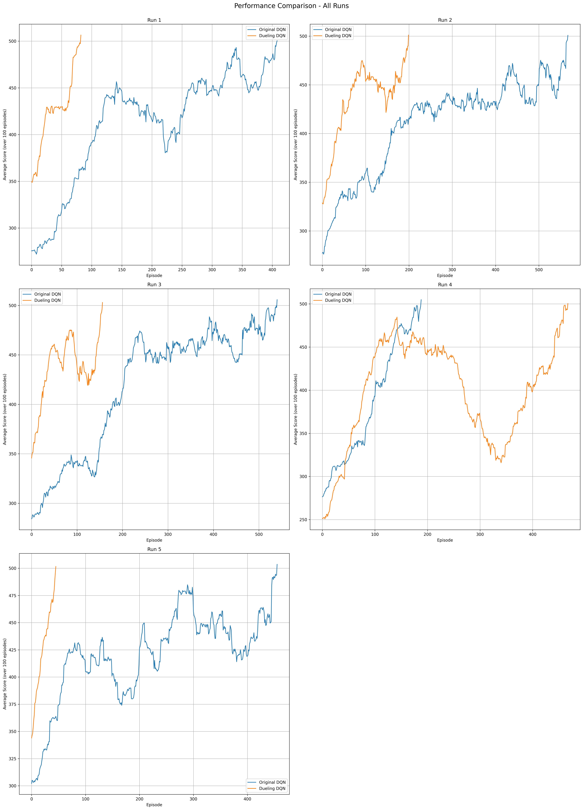

# Deep Convolutional Q-Learning for MsPacman

## Table of Contents

1. [Project Overview](#1-project-overview)
2. [Environment: MsPacmanDeterministic-v0](#2-environment-mspacmandeterministic-v0)
3. [Convolutional Neural Networks (CNNs)](#3-convolutional-neural-networks-cnns)
4. [Network Architectures](#4-network-architectures)
5. [Project Implementation](#5-project-implementation)
6. [Hyperparameters](#6-hyperparameters)
7. [Performance Comparison](#7-performance-comparison)
8. [Video Demonstrations](#8-video-demonstrations)
9. [References](#references)
10. [Setting Up the Environment](#setting-up-the-environment)
11. [Using the Environment](#using-the-environment)
12. [Troubleshooting](#troubleshooting)

## 1. Project Overview

This project implements a deep reinforcement learning agent to play the Ms. Pac-Man game using the `MsPacmanDeterministic-v0` environment from Gymnasium's Atari suite. The agent uses Convolutional Neural Networks (CNNs) to process game frames and make decisions based on Q-learning principles. I compare two architectures: the Deep Q-Network (DQN) and the Dueling DQN.

## 2. Environment: MsPacmanDeterministic-v0

- **Action Space**: Discrete(5) - NOOP, UP, RIGHT, LEFT, DOWN (Note:A reduced action space is used in this implementation)
- **Observation Space**: RGB images (210x160x3)
- **Frame Skip**: 4 frames per action
- **Repeat Action Probability**: 0.25

For more details, see the [Gymnasium Documentation](https://gymnasium.farama.org/).

## 3. Convolutional Neural Networks (CNNs)

CNNs are particularly effective for processing grid-like data, such as game frames. Key components include:

- **Convolutional Layers**: Apply filters to input data to detect features.
- **Pooling Layers**: Reduce spatial dimensions and extract dominant features.
- **Activation Functions**: Introduce non-linearity, typically ReLU for CNNs.
- **Fully Connected Layers**: Combine features for final output, often Q-values in this case.

CNNs are well-suited for game playing tasks because they can automatically learn relevant features from raw pixel data and maintain spatial relationships in the input.

## 4. Network Architectures

This project implements and compares two deep reinforcement learning architectures for playing Ms. Pac-Man: the Deep Convolutional Q-Network (DQN) and the Dueling DQN.

### DQN (Deep Q-Network)

The DQN architecture is a deep convolutional neural network that takes game screen images as input and outputs Q-values for each possible action. 

Key components:
- **Input**: RGB game frames (3 channels, 128x128 pixels after preprocessing)
- **Convolutional Layers**: 4 layers with increasing depth (32, 64, 64, 128 channels)
- **Batch Normalization**: Applied after each convolutional layer for training stability
- **Activation Function**: ReLU used throughout the network
- **Fully Connected Layers**: 3 layers (512, 256, action_size neurons)

### Dueling DQN

The Dueling DQN architecture separates the estimation of the state value function and the state-dependent action advantage function.

Key components:
- **Convolutional Layers**: 3 layers with increasing depth (32, 64, 64 channels)
- **Batch Normalization**: Applied after each convolutional layer for training stability
- **Activation Function**: ReLU used throughout the network
- **Value Stream**: 2 fully connected layers (512, 1 neurons)
- **Advantage Stream**: 2 fully connected layers (512, action_size neurons)
- **Aggregation Layer**: Combines value and advantage estimates to produce Q-values using the formula: 

    $Q(s,a) = V(s) + (A(s,a) - mean(A(s,a)))$
  
  Where:
  - Q(s,a) is the estimated Q-value for state s and action a
  - V(s) is the estimated value of state s (from the Value stream)
  - A(s,a) is the estimated advantage of taking action a in state s (from the Advantage stream)
  - mean(A(s,a)) is the mean of the advantage values across all actions for state s

This aggregation method ensures that the advantage function is zero-centered for each state, which can improve learning stability and performance.

### Key Differences

1. **Architecture**: While both networks use similar convolutional bases, the Dueling DQN splits into two streams (Value and Advantage) instead of using standard fully connected layers.
2. **State-Action Value Decomposition**: Dueling DQN explicitly separates state value estimation from action advantages.
3. **Aggregation**: Dueling DQN uses a special aggregation layer to combine the Value and Advantage streams, allowing it to learn state values independently of specific actions.



## 5. Project Implementation

### Environment Setup

This project uses the Gymnasium library to create the Ms. Pac-Man environment. The environment is initialized with a reduced action space to simplify the learning task.

### Frame Preprocessing

Game frames are preprocessed to make them suitable for the CNN:

1. The numpy array representing the frame is converted to a PIL Image.
2. The image is resized to 128x128 pixels.
3. The image is converted to a PyTorch tensor.
4. A batch dimension is added to make the tensor compatible with the network.

### Key Components

- **Input**: RGB game frames (3 channels, 128x128 pixels after preprocessing)
- **Convolutional Layers**: Extract spatial features from the input frames
- **Batch Normalization**: Stabilizes learning and allows higher learning rates
- **Fully Connected Layers**: Map extracted features to Q-values for each action

### Forward Pass

The forward pass through the network involves:

1. Passing the input through convolutional layers with ReLU activation and batch normalization
2. Flattening the output of the convolutional layers
3. Passing the flattened output through fully connected layers
4. Outputting Q-values for each possible action

## 6. Hyperparameters

The project uses the following hyperparameters:

- **Learning Rate**: 5e-4
- **Minibatch Size**: 64
- **Discount Factor**: 0.99
- **Replay Buffer Size**: 10,000
- **Epsilon**: Initial value of 1.0, decayed by 0.995 each episode, minimum value of 0.01
- **Maximum Timesteps per Episode**: 10,000
- **Number of Episodes**: 2,000 (maximum, training stops if environment is solved earlier)

These hyperparameters are crucial for the training process and may be adjusted to optimize the agent's performance.

## 7. Performance Comparison

I compared the performance of the DQN and the Dueling DQN over five separate training runs, the environment is considered solved when the rolling average score over the past 100 episodes exceeds 500. The following plot shows the average score over 100 episodes for each run:



### Analysis of Results:

1. **Convergence**: Both the original DQN and Dueling DQN consistently converge to higher scores over time, indicating successful learning.

2. **Stability**: The Dueling DQN (orange line) generally shows more stable learning curves with less variance compared to the original DQN (blue line).

3. **Learning Speed**: The Dueling DQN often shows faster initial learning, reaching higher scores more quickly in the early stages of training. And out of 5 runs it reaches a solution before the DQN network in 4 of the runs.

These results suggest that the Dueling DQN architecture generally offers improved performance and stability compared to the original DQN for the Ms. Pac-Man task. The difference in training time is very large being over twice as fast in most runs. 

## 8. Video Demonstrations

To visually compare the performance of the trained agents, I show the recorded gameplay videos for three scenarios: a random agent, the trained original DQN agent, and the trained Dueling DQN agent. These videos provide insight into the strategies learned by each agent and demonstrate the improvement over random play. A random run of 5 environments was used and the highest scoring run was chosen for each of the networks. There is still variation in the agents when they face new challenges but Dueling DQN does seem to have developed a better policy for solving the environment.

1. **Random Agent**: 
   
   [](https://youtube.com/shorts/sfBVRLQma90)
   
   This video shows an agent making random actions in the Ms. Pac-Man environment. It serves as a baseline to compare against the trained agents.

2. **Original DQN Agent**: 

   [](https://youtube.com/shorts/N0iNGiovWGQ)
   
   This video demonstrates the performance of the trained DQN agent. Observe how it has learned to navigate the maze, avoid ghosts, and collect pellets.

3. **Dueling DQN Agent**:

   [](https://youtube.com/shorts/6d_yHHRfj-s)
   
   This video showcases the gameplay of the trained Dueling DQN agent. Notice how movements seem to be precise and how it also appears to evade ghosts for the most part

### Analysis of Agent Behaviors:

Based on the scores obtained after a sampling of 5 trials (Random Agent: 330.0, Original DQN: 300.0, Dueling DQN: 900.0), and considering the gameplay videos, we can make the following observations:

1. **Random Agent** (Score: 330.0): 
   - Surprisingly, the random agent achieved a respectable score, outperforming the Original DQN in this instance.
   - While its movements lack strategy, the randomness occasionally results in successful pellet collection and ghost avoidance.
   - This performance underscores the importance of exploration in reinforcement learning, as random actions can sometimes yield unexpected positive results.

2. **Original DQN Agent** (Score: 300.0):
   - Contrary to expectations, the Original DQN agent scored lower than the random agent in this particular run.
   - However, its movements are not erratic. The agent shows more purposeful navigation of the maze compared to the random agent.
   - The lower score suggests that the agent might have developed a suboptimal strategy or encountered particularly challenging ghost behavior in this instance.
   - It's important to note that this single run may not be representative of the agent's overall performance across multiple episodes.

3. **Dueling DQN Agent** (Score: 900.0):
   - The Dueling DQN significantly outperformed both the random agent and the Original DQN in this run.
   - This agent demonstrates:
     - More efficient maze navigation
     - Better ghost avoidance strategies
     - More strategic use of power pellets
     - Improved long-term planning for pellet collection

Key Takeaways:
- The performance of reinforcement learning agents can vary significantly between episodes. A single run may not fully represent an agent's capabilities.
- The substantial outperformance of the Dueling DQN suggests that its architecture may be better suited for this task, potentially due to its ability to separate state value estimation from action advantages.
- The unexpectedly good performance of the random agent and the underperformance of the Original DQN in this instance highlight the complexity of the Ms. Pac-Man environment and the challenges in developing consistently effective strategies.

These results emphasize the importance of evaluating agent performance over multiple runs and considering both quantitative scores and qualitative behavior observations. While the Dueling DQN clearly excelled in this sample, further analysis across more episodes would provide a more comprehensive understanding of each agent's true capabilities and consistency, the criteria for stopping training is very likely sub-optimal but training times are quite lengthy and to achieve a true solution would go beyond this exploratory project.

## References
This was a project started during the Udemy course:
- Artificial Intelligence A-Z 2024: Build 7 AI + LLM & ChatGPT 
   - Created by Hadelin de Ponteves, Kirill Eremenko, SuperDataScience Team, Luka Anicin and the Ligency Team
   - https://www.udemy.com/share/101Wpy3@8EUG1WmSHuIQ8NJ8MqbUIKERQL-i115amp8Wv-vEns_QefgYHXhNbCiRxagVIsqkvA==/

## Setting Up the Environment

1. **Clone the Repository**:
   First, clone the repository to your local machine using Git:
   ```bash
   git clone [repository-url]
   cd [repository-name]
   ```
   Replace `[repository-url]` and `[repository-name]` with the actual URL and name of the Git repository.

2. **Create the Conda Environment**:
   Create the Conda environment using the `DQL_environment.yml` file included in the repository:
   ```bash
   conda env create -f DQL_environment.yml
   ```
   This command reads the `DQL_environment.yml` file in the repository, which contains all the necessary package dependencies and settings, and creates a Conda environment based on it.

3. **Activate the Conda Environment**:
   Once the environment is created, you can activate it using the following command:
   ```bash
   conda activate DQL_environment
   ```

4. **Launch Jupyter Notebook**:
   After activating the environment, you can start the Jupyter Notebook server:
   ```bash
   jupyter notebook
   ```
   This command launches Jupyter Notebook, and you should be able to open and run the notebooks in the browser.

## Using the Environment

With the environment set up and activated, you are now ready to run the project's notebooks. These notebooks are pre-configured to use the packages and settings defined in the `DQL_environment.yml` file, ensuring compatibility and reproducibility of the results.

### Running the Notebooks

To run the notebooks, follow these steps:

1. **Navigate to the Project Directory**:
   Make sure you are in the project directory where the notebooks are located.

2. **Start Jupyter Notebook**:
   Use the following command to start Jupyter Notebook:
   ```bash
   jupyter notebook
   ```
   This will open the Jupyter Notebook interface in your default web browser.

3. **Open a Notebook**:
   In the Jupyter Notebook interface, navigate to the notebook you want to run (e.g., `DCQL_Pac-Man.ipynb`) and click on it to open.

4. **Run the Notebook**:
   Once the notebook is open, you can run the cells sequentially by clicking on each cell and pressing `Shift + Enter`. Alternatively, you can use the "Run All" option under the "Cell" menu to execute all cells at once.

### Evaluating the Results

After running the notebooks, you can evaluate the performance of the DQN and Dueling DQN agents based on the generated plots and metrics. The results section in the notebooks will provide detailed insights into the training progress and final performance of the agents in the Ms. Pac-Man environment.

## Troubleshooting

If you encounter any issues during the setup or while running the notebooks, here are some common troubleshooting steps:

1. **Ensure Correct Conda Environment**:
   Make sure that you have activated the correct Conda environment using:
   ```bash
   conda activate DQL_environment
   ```

2. **Check Package Versions**:
   Verify that the package versions in the `DQL_environment.yml` file match the versions installed in your environment. You can list the installed packages using:
   ```bash
   conda list
   ```

3. **Recreate the Environment**:
   If you encounter dependency issues, try recreating the Conda environment:
   ```bash
   conda env remove -n DQL_environment
   conda env create -f DQL_environment.yml
   ```

4. **Consult Documentation**:
   Refer to the documentation of the packages used (e.g., Gymnasium, PyTorch) for specific issues related to those libraries.

5. **Seek Help**:
   If you are unable to resolve the issue, you can seek help by creating an issue on the project's GitHub repository or by reaching out to the community forums of the respective libraries.